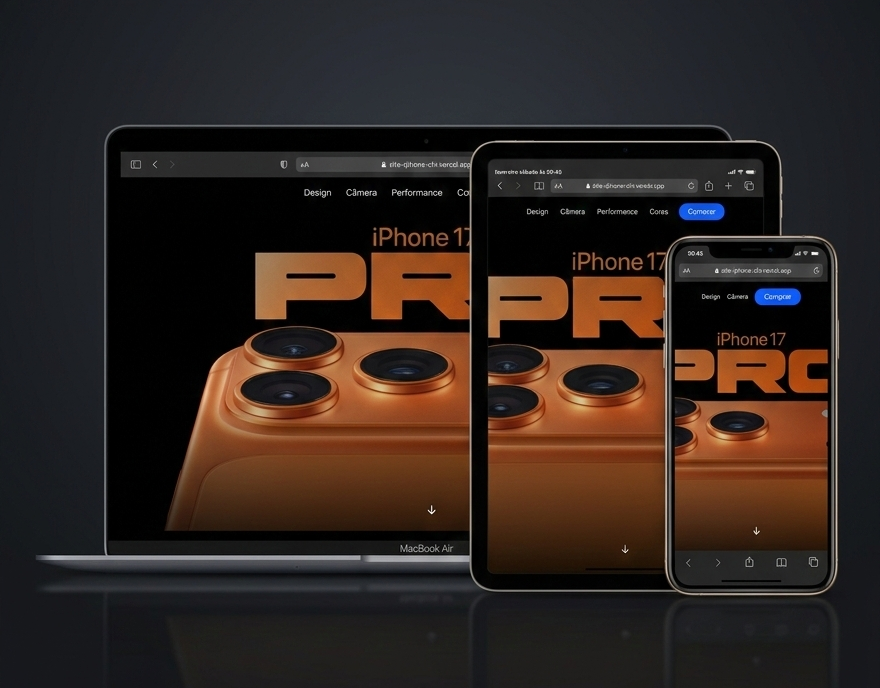

# :iphone: Landing Page iPhone 17

<p>Landing page com foco na apresentação do produto iPhone 17 em uma interface moderna, elegante e adaptável a diferentes dispositivos.</p>
<p> :round_pushpin: O projeto foi construído com foco em:</p>
<ul>
  <li>Componentização com React</li>
  <li>Estilização moderna utilizando Tailwind CSS</li>
  <li>Layout responsivo</li>
  <li>Organização de estrutura e reutilização de componentes</li>
  <li>Experiência visual inspirada em páginas de produto</li>
</ul>

🔗 Deploy: https://site-iphone-chi.vercel.app/

📁 Repositório: https://github.com/MarianaASoares/site-iphone

---

# :rocket: Tecnologias

 

---

# :camera: Preview

  

 🔗 [Ver projeto](https://site-iphone-chi.vercel.app/) 

 ---

 # :gear: Funcionalidades

<p>:heavy_check_mark: Seção principal de apresentação do produto.</p>
<p>:heavy_check_mark: Layout moderno e minimalista.</p>
<p>:heavy_check_mark: Componentes reutilizáveis.</p>
<p>:heavy_check_mark: Design responsivo .</p>
<p>:heavy_check_mark: Estrutura organizada de pastas.</p>

---

# :iphone: Responsividade

<p>A aplicação foi desenvolvida utilizando as classes utilitárias do Tailwind para garantir adaptação fluida entre:</p>
<ul>
  <li>:computer: Desktop</li>
  <li>:calling: Tablet</li>
  <li>:iphone: Mobile</li>
</ul>

<p>O layout mantém consistência visual e boa experiência do usuário em diferentes resoluções.</p>

---

# :file_folder: Como executar localmente

```
# Clone o repositório
git clone https://github.com/SEU-USUARIO/NOME-DO-REPOSITORIO.git

# Acesse a pasta do projeto
cd NOME-DO-REPOSITORIO

# Instale as dependências
npm install

# Execute o projeto
npm run dev
```


